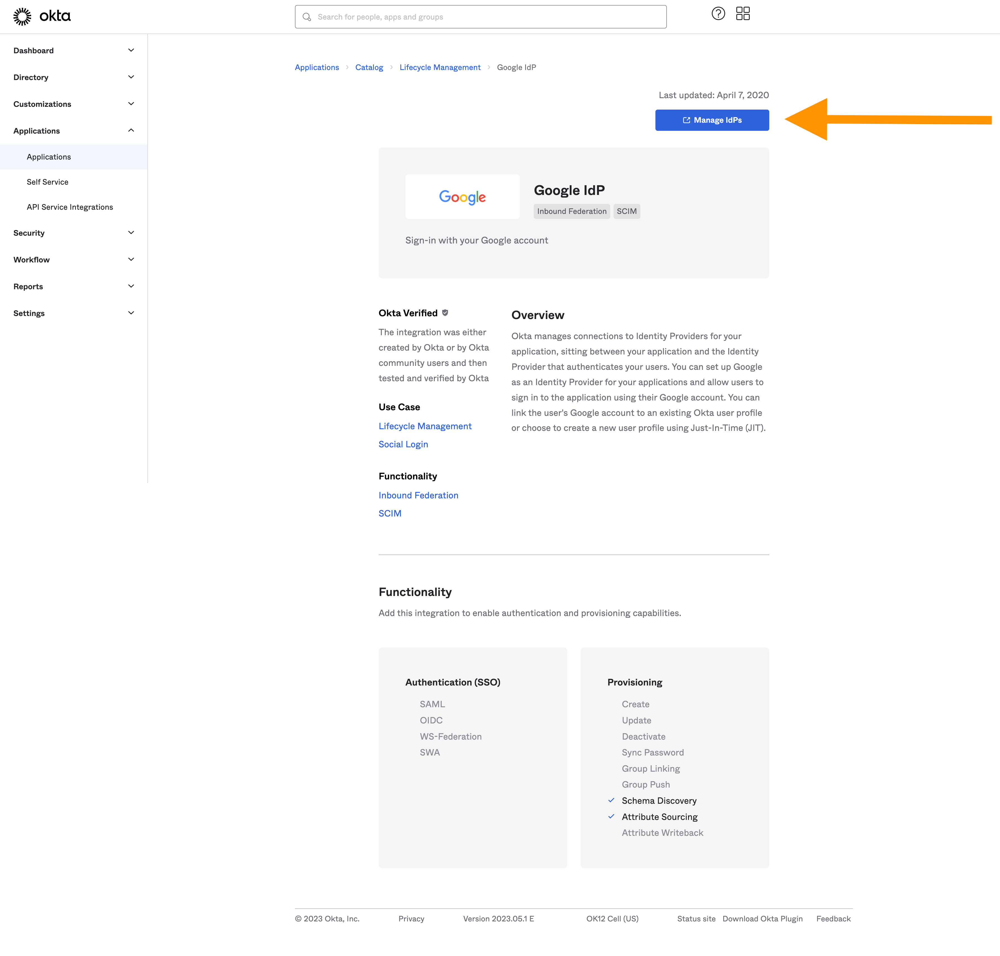

# Okta integration

Integration target

- Google
- Microsoft

## Demo

- https://okta.gapmoe.net

## Getting started (Google)

Reference [link](https://developer.okta.com/docs/guides/sign-into-web-app-redirect/node-express/main/)

1. Choose IdP (Identity Provider)
   

2. In this case, we choosed google.
   

3. To integrate with google, you must input the `client id`, and `client secret`.
   

4. Open the google cloud console and move to `Oauth consent screen` tab. And fill the form

5. Move to `credentials` tab. And click OAuth Client ID.
   

6. Setup your app's domain and endpoint
   

7. Fill out something else...

8. After that, you can get `client id` and `client secret`

9. Back to the Okta console. If you insert them, the setup is done.

## Getting started (Microsoft)

Reference [link](https://learn.microsoft.com/en-us/graph/tutorials/javascript?tabs=aad&tutorial-step=1)

1. Add microsoft IdP from Okta. Same as Google IdP integration.

2. Go to azure portal. Move to `Azure Active Directory` > `Application` > `App registerations` and create new app.

3. Go to `Credentials and Password` > `Client secret` tab. And create new secret key.

4. Type `client id` and `client secret` to Okta input form.
